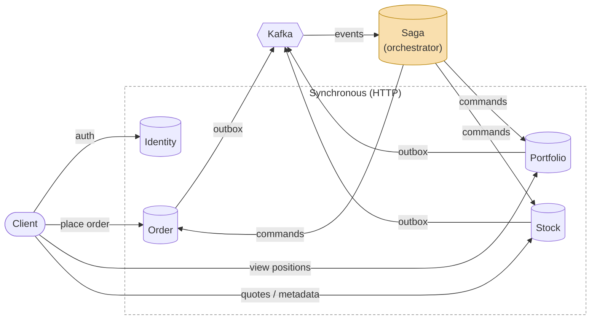

# TradingSystem

A learning/pet project implementing a trading platform as a set of independent microservices. The goal is to practice patterns actually used in high-load distributed systems: event sourcing, the outbox pattern, saga orchestration, CQRS, and reliable messaging between services.

> The project is under active development. Below is an honest status of what's done, what's in progress, and what's planned.

## Architecture (target)

The system is made up of 5 services:

| Service | Responsibility | Status |
|---|---|---|
| **Stock** | Stock metadata, quotes, price history, read models (daily/hourly/weekly) | 🟡 In progress |
| **Order** | Accepting and executing buy/sell orders | ⚪ Planned |
| **Portfolio** | User positions, balance, portfolio value aggregation | ⚪ Planned |
| **Saga** | Orchestrates distributed transactions across Order/Portfolio/Stock | ⚪ Planned |
| **Identity** | User authentication and authorization | ⚪ Planned |

Services communicate asynchronously over Kafka, using the outbox pattern to guarantee event delivery without losing consistency between the database and the message broker.



Each service owns its own database and publishes domain events through its outbox; the Saga service subscribes to these events and drives cross-service workflows (e.g. *place order → reserve funds → update portfolio → confirm*), including compensating actions on partial failure.

## Tech stack

- **.NET 10**, C#
- **MediatR** — CQRS (command/query separation)
- **Kafka** (Confluent.Kafka) — asynchronous event exchange between services
- **MS SQL Server** + **Dapper** — persistence and event store
- **dbup** — versioned SQL migrations
- **Hangfire** — background jobs and cron tasks (building aggregated read models)
- **Polly** — resilience policies (retry, circuit breaker) for external calls
- **protobuf-net** — binary serialization of events between services
- **Docker Compose** — local infrastructure setup

## What's already implemented (Stock service)

Stock is the first and most advanced service in the system. It's where the patterns that will be reused across the other services are being worked out.

- **Event Sourcing** — a stock's state is rebuilt from its event stream (`StockCreateEvent`, `PriceChangeEvent`, `StockToggledStatusEvent`), with a `BasicEvent` base class as a shared event template.
- **Outbox pattern** — the domain event and the outgoing message are written atomically in a single transaction; a dedicated `OutboxDispatcherService` reads and publishes accumulated events to Kafka.
- **Batched writes via Table-Valued Parameters (TVP)** — inserts multiple outbox rows in a single database round-trip instead of row-by-row inserts, reducing database load under high event throughput.
- **CQRS** — commands (`CreateStock`, `ChangeStockName`, `ToggleStockOpenToTrade`, etc.) and queries (`GetReadModel`, `GetDailyReadModel`, `GetHourlyReadModel`, `GetWeeklyReadModel`) are fully separated via MediatR.
- **Read models at multiple granularities** — daily, hourly, and weekly data slices built asynchronously so they never block commands.
- **Background processing** — a `DailyReadModelWorker` and Hangfire cron jobs regularly build aggregates.
- **Kafka consumer/producer infrastructure** — producer/consumer factories, event handlers (`StockEventKafkaHandler`), and message version tracking (`VersionsBuffer`) to guard against race conditions during processing.
- **Layered architecture** — a clean split between Application / Infrastructure / Presentation, with abstractions (`IStockEventStore`, `IUnitOfWork`, `IOutboxWriter`, etc.) decoupled from concrete implementations.
- **Versioned database migrations** — 5 sequential SQL migrations (initial → outbox → read models → outbox retries → TVP outbox).
- **Resilience** — Polly policies for network calls and external dependencies.

### In progress

- HTTP controllers and use cases for interacting with the service (`StockController`, `StockReadController`, `StockMetadataController`) — the basics are in place, still being refined.

## What's planned

- [ ] **Order service** — order intake, validation, and interaction with Stock for live quotes.
- [ ] **Portfolio service** — position and portfolio value calculation based on executed orders.
- [ ] **Identity** — user authentication (leaning towards an off-the-shelf solution like Keycloak instead of a custom-built service).
- [ ] **Saga service** — orchestration of the distributed *place order → reserve funds → update portfolio* transaction, with partial-failure handling and compensating actions.
- [ ] Observability: structured logging and tracing across services.
- [ ] Integration and end-to-end tests for cross-service scenarios.
- [ ] Extracting reusable infrastructure (outbox, Kafka plumbing) into a shared package for all services.

## Running locally

```bash
docker compose -f compose.yaml up -d
```

> Setup instructions will be expanded as the remaining services come online.
