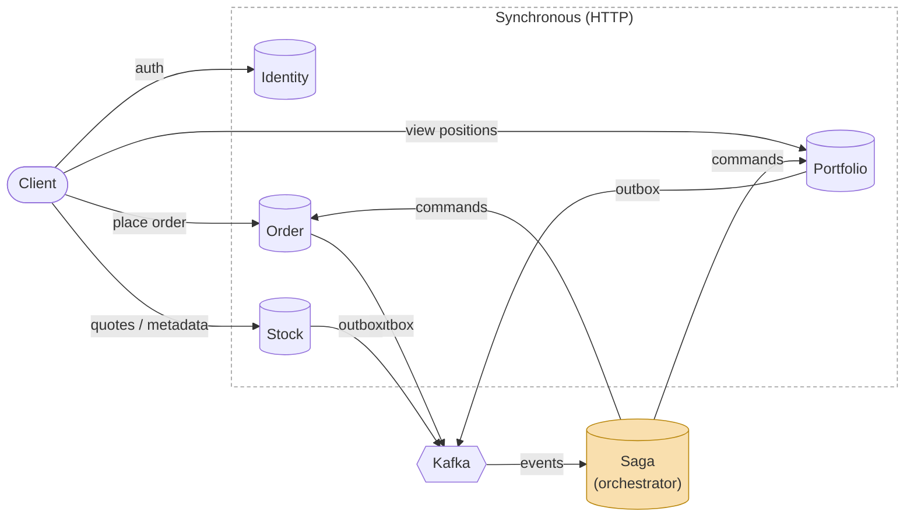

# TradingSystem

[](https://github.com/KeqJiil/TradingSystem/actions/workflows/ci.yml)

A learning/pet project implementing a trading platform as a set of independent microservices. The goal is to practice patterns actually used in high-load distributed systems: event sourcing, the outbox pattern, saga orchestration, CQRS, and reliable messaging between services.

> The project is under active development. Below is an honest status of what's done, what's in progress, and what's planned.
> Design decisions and known limitations are recorded in [docs/adr](docs/adr/README.md).

## Architecture (target)

The system is made up of 5 services:

| Service | Responsibility | Status |
|---|---|---|
| **Stock** | Stock metadata, price, price history, OHLC candles (hourly/daily) | 🟢 Feature-complete |
| **Order** | Accepting and executing buy/sell orders | ⚪ Planned |
| **Portfolio** | User positions, balance, portfolio value aggregation | ⚪ Planned |
| **Saga** | Orchestrates distributed transactions across Order/Portfolio | ⚪ Planned |
| **Identity** | User authentication and authorization | ⚪ Planned |

Services communicate asynchronously over Kafka, using the outbox pattern to guarantee event delivery without losing consistency between the database and the message broker.


```mermaid
flowchart LR
    Client([Client])

    subgraph Sync["Synchronous (HTTP)"]
        Identity[("Identity")]
        Order[("Order")]
        Portfolio[("Portfolio")]
        Stock[("Stock")]
    end

    Saga[("Saga\n(orchestrator)")]
    Kafka{{"Kafka"}}

    Client -->|"auth"| Identity
    Client -->|"place order"| Order
    Client -->|"view positions"| Portfolio
    Client -->|"quotes / metadata"| Stock

    Order -- outbox --> Kafka
    Portfolio -- outbox --> Kafka
    Stock -- outbox --> Kafka

    Kafka -- events --> Saga
    Saga -- commands --> Order
    Saga -- commands --> Portfolio

    style Saga fill:#f9dfae,stroke:#b8860b
    style Sync fill:transparent,stroke:#999,stroke-dasharray: 4 3
```

Each service owns its own database and publishes domain events through its outbox; the Saga service subscribes to these events and drives cross-service workflows (e.g. *place order → reserve funds → update portfolio → confirm*), including compensating actions on partial failure.

Stock is not a saga participant: it publishes price and metadata events, and Order / Saga keep local replicas of them ([ADR-0011](docs/adr/0011-saga-and-stock-interaction.md), proposed).

## Tech stack

- **.NET 10**, C#, minimal APIs
- **MediatR** — CQRS, with validation, tracing and resilience pipeline behaviours
- **FluentValidation** — command and query validation
- **Kafka** (Confluent.Kafka) — asynchronous event exchange, retry and dead-letter topics
- **MS SQL Server** + **Dapper** — persistence and event store
- **dbup** — versioned SQL migrations
- **Hangfire** — cron jobs (candles, outbox cleanup)
- **Polly** — whole-transaction retry on transient SQL errors
- **protobuf-net** — binary serialization of events between services
- **OpenTelemetry** — traces, metrics and logs (Aspire dashboard locally)
- **xUnit** + **Testcontainers** — integration tests against real SQL Server and Kafka
- **Docker Compose** — local infrastructure setup

## Stock service

Stock is the first service in the system. It's where the patterns that will be reused across the other services are being worked out.

- **Event sourcing for price only** — `events_store` is an append-only log of price deltas; metadata (name, currency, trading hours, open-to-trade flag) is state-based CRUD with a monotonic `metadata_version` ([ADR-0001](docs/adr/0001-event-sourcing-for-price-only.md)).
- **Transactional outbox** — the change and its outgoing message are written in one transaction (batched through a table-valued parameter); a polling relay publishes them to Kafka with retries and a DLQ ([ADR-0004](docs/adr/0004-transactional-outbox.md)).
- **CQRS with an asynchronous read model** — Stock consumes its own topics to build `stock_data_projection`: per-field last-writer-wins for metadata, version checks for price, with gaps filled inline by replaying `events_store` ([ADR-0002](docs/adr/0002-async-read-model-via-kafka.md)).
- **OHLC candles** — hourly and daily candles by event time, computed by Hangfire cron jobs and immutable once written ([ADR-0003](docs/adr/0003-ohlc-candles-by-event-time.md)).
- **Kafka failure handling** — manual offset store, poison messages, retry and fatal dead-letter topics ([ADR-0005](docs/adr/0005-kafka-consumption-and-failure-handling.md)).
- **Idempotency without an inbox** — domain versions and natural keys make redelivery safe ([ADR-0006](docs/adr/0006-idempotency-without-inbox.md)).
- **Observability** — correlation id alongside W3C trace context across HTTP, outbox, Kafka and Hangfire ([ADR-0007](docs/adr/0007-correlation-id-and-trace-context.md)); health checks at `/health/live` and `/health/ready`.
- **Unit of Work** — optimistic concurrency and retry of the whole transaction ([ADR-0008](docs/adr/0008-unit-of-work-and-transaction-retry.md)).
- **HTTP API** under `/api/v1/stocks` — idempotent creation (`PUT /{id}`), name / trading hours / open-to-trade changes, metadata, current price and candles. Requests are in [Stock.http](src/Services/Stock/Stock.http).
- **Versioned migrations** — 14 sequential dbup scripts in [Migrations](src/Services/Stock/Infrastructure/Persistence/Migrations).

Known limitations (late events, missed cron runs, outbox ordering, single partition, etc.) are listed in the [ADR index](docs/adr/README.md#known-limitations).

## What's planned

- [ ] **Schema-first protobuf contracts** — absolute price, metadata snapshot, time zones ([ADR-0009](docs/adr/0009-schema-first-protobuf-contracts.md)).
- [ ] **Shared Messaging library** — outbox, inbox, Kafka consumer host and topology for all services; Stock migrates to it ([ADR-0010](docs/adr/0010-shared-messaging-library.md)).
- [ ] **Order service** — order intake and validation, with a matching engine as the future price source.
- [ ] **Portfolio service** — position and portfolio value calculation based on executed orders.
- [ ] **Saga service** — orchestration of the distributed *place order → reserve funds → update portfolio* transaction, with partial-failure handling and compensating actions.
- [ ] **Identity** — user authentication (leaning towards an off-the-shelf solution like Keycloak instead of a custom-built service).
- [ ] End-to-end tests for cross-service scenarios.

## Running locally

Create a `.env` file next to `compose.yaml`:

```dotenv
MSSQL_STOCK_PASSWORD=<sa password>
ConnectionStrings__DefaultConnection=Server=stock-db,1433;Database=StockDb;User Id=sa;Password=<sa password>;TrustServerCertificate=True
```

```bash
docker compose up -d
```

The Stock API is on `http://localhost:8081`. Add `--profile observability` to also start the Aspire dashboard on `http://localhost:18888`.

## Tests

Tests start SQL Server and Kafka in containers, so Docker must be running.

```bash
dotnet test TradingSystem.slnx
```
